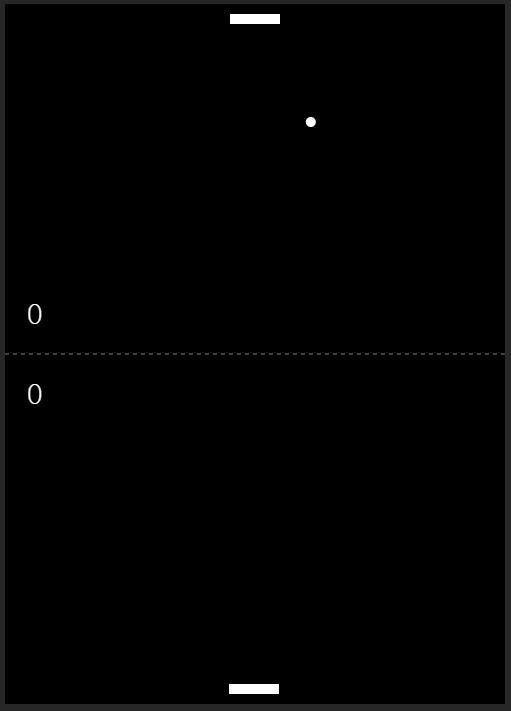
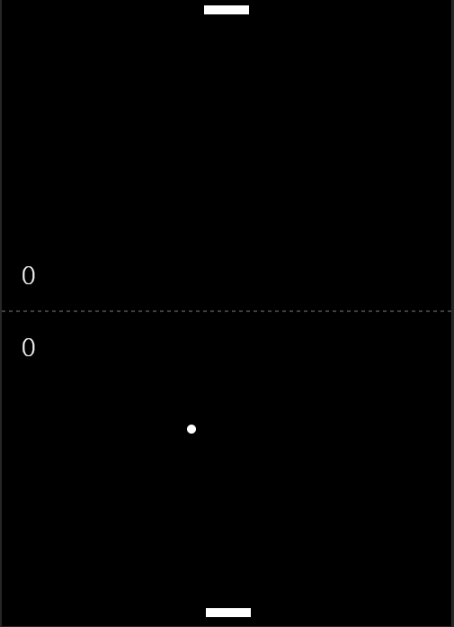
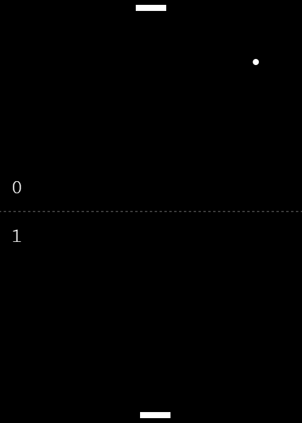
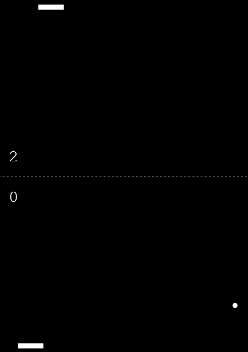

<p align='center'>
	
</p>

<h3 align="center">
	Pong
</h3>

<p align="center">
	Real-time Multiplayer Pong Game.
</p>

## About The Project

An implementation of the Pong game with real-time features using the WebSocket protocol (instead of the traditional polling approach). Try it out in just a few simple installation commands!

### Core Technologies

- 

- 

- 

- 

## Getting Started

### Workspace Set-up

- Create a new workspace folder in local machine.

  ```sh
  mkdir <WORKSPACE-NAME>
  ```

- Clone the repo.

  ```sh
  git clone <REPO-LINK>
  ```

### Installation

- From the workspace folder, go to the front-end directory and install necessary packages.

  ```sh
  cd <REPO-NAME>
  npm install
  ```

### Run

- With Node (any of the following commands).

  ```sh
  npm start
  npm run start
  npm run start-node
  ```

- With Nodemon.

  ```sh
  npm run start-nodemon
  ```

- The clients now will be hosted in `localhost:3000`.

- Open multiple windows can see real-time functionalities of the game in action!

## Usage

Simply move your cursor left and right to control the paddle! The score between you and the opponent will be automatically updated in the left pane.

<p align="center">
	
	
	<br />
	
	
</p>

## Features

- [x] Automatically group clients and start games when there are enough connections
- [x] Real-time syncing between player sessions
- [x] Responsive and maneuverable game user interface
- [x] Automatically manage players's scores
- [x] Player disconnection handling
- [x] Clean back-end architecture and documentation facilitating further development
  - [x] Events forwarded to specific handlers
  - [x] Centralized state management

## Contributing

Contributions are what make the open source community such an amazing place to learn, inspire, and create. Any contributions you make are **greatly appreciated**.

If you have a suggestion that would make this better, please fork the repo and create a pull request. You can also simply open an issue with the tag "enhancement".

1. Fork the Project

2. Create your Feature Branch

   ```sh
   git checkout -b feature/<YOUR-AMAZING-PROPOSED-FEATURE>
   ```

3. Commit your Changes

   ```sh
   git commit -m <YOUR-COMMIT-MESSAGE>
   ```

4. Push to the Branch

   ```sh
   git commit -m 'git push origin feature/<YOUR-AMAZING-PROPOSED-FEATURE>'
   ```

5. Open a Pull Request

## Acknowledgments

This project was originally inspired by the legacy game Pong, Odziemkowski's version of multi-player Pong, and Facebook's Redux state management library.

External resources and readings.

- https://socket.io/docs/v4/

- https://expressjs.com/en/4x/api.html

- https://nodejs.org/en/about/

- https://developer.mozilla.org/en-US/docs/Web/API/WebSockets_API

- https://developer.mozilla.org/en-US/docs/Learn/JavaScript/Client-side_web_APIs/Drawing_graphics

- https://developer.mozilla.org/en-US/docs/Learn/Server-side/Express_Nodejs/deployment
